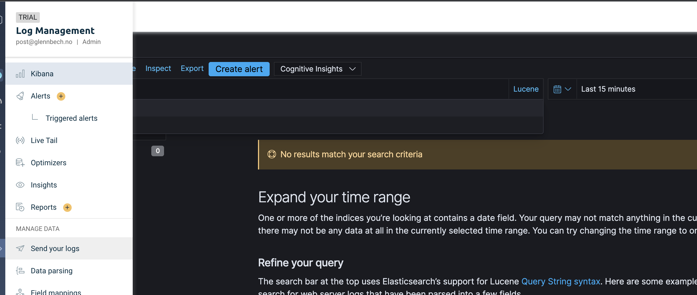
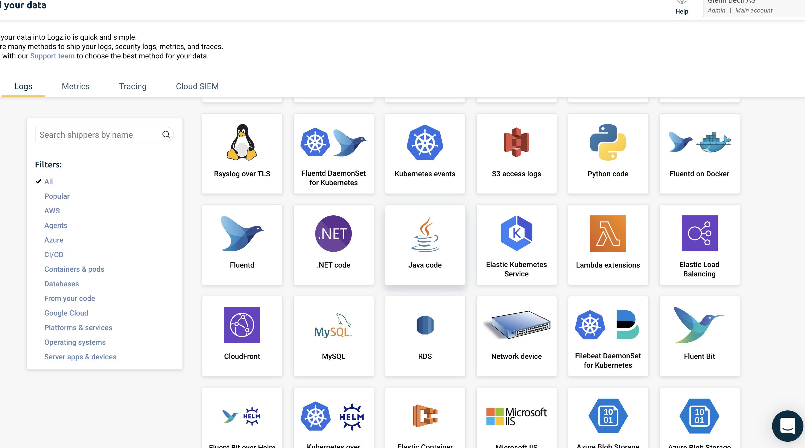

# Logz.io

I denne labben skal vi se hvor enkelt det er å sende logger til en SAAS tjeneste som heter logz.io fra Spring Boot applikasjonen. Vi skal også se på 12 factor prinsippet "Config" ved å ikke hardkode token og endepunlt for Logz.io i property filer. 

I denne øvelsen kan det være lurt å bruke en enkel Spring Boot applikasjon som kan deployes til Heroku. 

## Registrer deg på logz.io

https://app.logz.io *
* Velg "free trial". 
* Bruk Frankfurt (AWS) som destinasjon 

Velg "Send your logs" 



Velg Java Application


Velg "Logback" fanen

* Gjør nødvendig endring i pom.xml filen i henhold til bruksanvisningen.

## Pass på å logge både til standard out og Logz.io

Modifiser Logback.xml slik at du også kan se loggene uten å gå til logz.io - Hvis du bruker deres eksempel, vil du miste logger i
terminalvinduet.

```xml
<!-- Use debug=true here if you want to see output from the appender itself -->
<configuration>
    <!-- Closes gracefully and finishes the log drain -->
    <shutdownHook class="ch.qos.logback.core.hook.DelayingShutdownHook"/>
    <appender name="STDOUT" class="ch.qos.logback.core.ConsoleAppender">
        <encoder>
            <pattern>%d %-5level [%thread] %logger{0}: %msg%n</pattern>
            <outputPatternAsHeader>true</outputPatternAsHeader>
        </encoder>
    </appender>

    <appender name="LogzioLogbackAppender" class="io.logz.logback.LogzioLogbackAppender">
        <token>${LOGZ_TOKEN}</token>
        <logzioUrl>https://listener-eu.logz.io:8071</logzioUrl>
        <logzioType>bankapp_weblogs</logzioType>
        <filter class="ch.qos.logback.classic.filter.ThresholdFilter">
            <level>INFO</level>
        </filter>
        <inMemoryQueue>true</inMemoryQueue>
        <inMemoryQueueCapacityBytes>-1</inMemoryQueueCapacityBytes>
    </appender>

    <logger name="org.springframework.web.filter.CommonsRequestLoggingFilter">
        <level value="DEBUG"/>
    </logger>

    <root level="INFO">
        <appender-ref ref="LogzioLogbackAppender"/>
        <appender-ref ref="STDOUT"/>
    </root>
</configuration>
```

## Ship logs 

* Se på koden i dette repoet og legg på mer logging på flere lognivåer (debug, trace, info osv) 
* Start applikasjonen lokalt - og du vil se at det kommer logger på logz.io 

## Ikke eksponer hemmeligheter

Vi ønsker ikke Logs.io API tokenet vårt i koden. Dette kan unngå ved å sette inn $LOGZ_TOKEN i logback filen. 
Og deretter sette miljøvariabel *før* vi starter Spring Boot applikasjonen. 

### Osx
```shell
export LOGZ_TOKEN=qLcjggEnnEKr2utHIHSxetBBKEkstasasasVkv
```
### Windows CMD
```shell

C:\> set LOGZ_TOKEN="qLcjggEnnEKr2utHIHSxetBBKEkstasasasVkv"
```

### Powershell
```shell
# Windows PowerShell
PS C:\> $env:LOGZ_TOKEN="qLcjggEnnEKr2utHIHSxetBBKEkstasasasVkv"
```
Før man starter spring boot applikasjonen 

## Lek med Logz.io

Bli kjent med minst; 

* Live Tail
* kibana og "Discover" panelet, der man kan søke etter logger og filtrere på ulike felter i loggene
* Visualiering. Prøv gjerne mer avanserte funksjoner - men i alle fall et Pie chart som fordeler logger i INFO, DEBUG, ERROR
